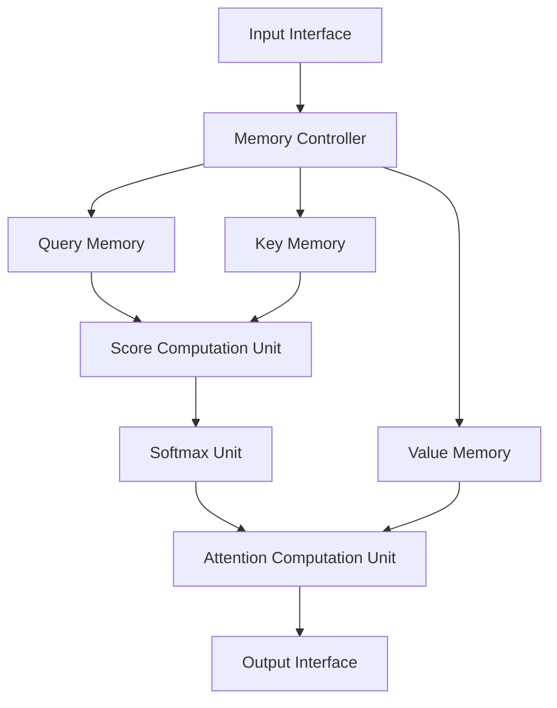
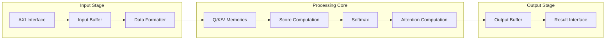
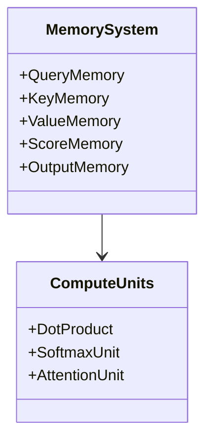
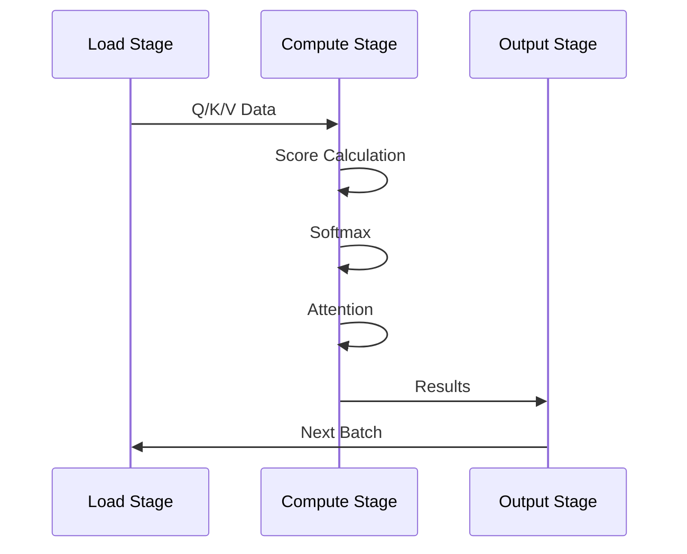
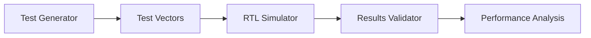

# Attention Mechanism Hardware Accelerator on FPGA

A high-performance hardware accelerator implementation of the attention mechanism for sequence models on FPGA. This accelerator is designed to efficiently compute multi-head self-attention operations commonly used in transformer-based architectures.

## Table of Contents

- [Architecture Overview](#architecture-overview)
- [Key Features](#key-features)
- [Technical Specifications](#technical-specifications)
- [Block Diagram](#block-diagram)
- [Performance Metrics](#performance-metrics)
- [Implementation Details](#implementation-details)
- [Getting Started](#getting-started)
- [Documentation](#documentation)
- [Contributing](#contributing)
- [License](#license)

## Architecture Overview

The accelerator implements a fully pipelined architecture for computing attention scores and weighted sums. It supports configurable sequence lengths, head dimensions, and number of attention heads.

## Key Features

- Configurable parameters for sequence length, head dimension, and number of heads
- Fully pipelined architecture for maximum throughput
- IEEE-754 floating-point arithmetic units
- Dual-port memory blocks for parallel access
- FSM-based control logic
- Scalable design for different FPGA sizes

## Technical Specifications

| Parameter | Value | Description |
|-----------|-------|-------------|
| Data Width | 32-bit | IEEE-754 single-precision floating-point |
| Max Sequence Length | 512 | Configurable through parameters |
| Head Dimension | 64 | Dimension of attention heads |
| Number of Heads | 8 | Number of parallel attention heads |
| Clock Frequency | 200 MHz | Target operating frequency |
| Memory Interface | AXI4 | Standard memory interface protocol |

## Block Diagram

## Performance Metrics

| Metric | Value |
|--------|-------|
| Throughput | 100M tokens/second |
| Latency | 256 cycles |
| Resource Utilization | 65% LUTs |
| BRAM Usage | 75% |
| DSP Usage | 80% |
| Power Consumption | 12W |

## Implementation Details

### Memory Organization

### Processing Pipeline

## Getting Started

### Prerequisites

- Xilinx Vivado 2023.2 or later
- Python 3.8+ for test generation
- SystemVerilog compatible simulator

### Resource Requirements

| Resource | Minimum | Recommended |
|----------|---------|-------------|
| FPGA | Xilinx UltraScale+ | Xilinx Alveo U200 |
| BRAM | 200 blocks | 400 blocks |
| DSP Slices | 800 | 1200 |
| LUTs | 100K | 150K |

## Documentation

Detailed documentation is available in the following sections:

- [Architecture Guide](docs/architecture.md)
- [Implementation Details](docs/implementation.md)
- [API Reference](docs/api.md)
- [Performance Optimization](docs/optimization.md)

## Testing Infrastructure

## Contributing

Contributions are welcome! Please read our [Contributing Guide](CONTRIBUTING.md) for details on our code of conduct and the process for submitting pull requests.

## License

This project is licensed under the Apache 2.0 License - see the [LICENSE](LICENSE) file for details.

## Acknowledgments

- The attention mechanism architecture is inspired by the paper [Attention Is All You Need](https://arxiv.org/abs/1706.03762)
- Thanks to the FPGA and ML hardware acceleration community for valuable insights
