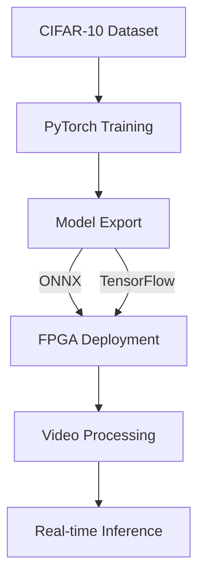
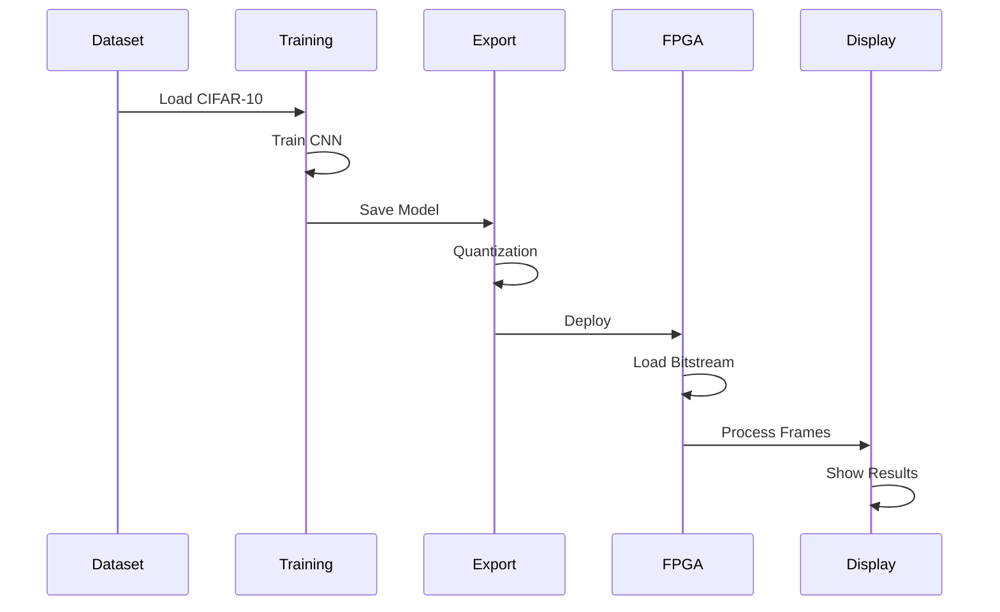

# CIFAR-10 Pattern Recognition on FPGA

This project implements deep learning-based pattern recognition on FPGA using the CIFAR-10 dataset, PyTorch, and PYNQ framework.

## Architecture Overview



## Dataset Information

| Class | Examples | Training Images | Test Images |
|-------|----------|----------------|-------------|
| Airplane | ✈️ | 5,000 | 1,000 |
| Automobile | 🚗 | 5,000 | 1,000 |
| Bird | 🐦 | 5,000 | 1,000 |
| Cat | 🐱 | 5,000 | 1,000 |
| Deer | 🦌 | 5,000 | 1,000 |
| Dog | 🐕 | 5,000 | 1,000 |
| Frog | 🐸 | 5,000 | 1,000 |
| Horse | 🐎 | 5,000 | 1,000 |
| Ship | 🚢 | 5,000 | 1,000 |
| Truck | 🚛 | 5,000 | 1,000 |

## Implementation Pipeline



## Project Structure

```
cifar10-fpga/
├── src/
│   ├── training/
│   │   ├── train_model.py
│   │   ├── data_loader.py
│   │   └── model.py
│   ├── deployment/
│   │   ├── deploy_model_fpga.py
│   │   └── utils.py
│   └── notebooks/
│       └── demo.ipynb
├── models/
│   ├── trained/
│   └── quantized/
├── bitstreams/
│   └── cifar10_cnn.bit
└── docs/
    └── images/
```

## Setup Instructions

### 1. Environment Setup

```bash
# Create virtual environment
python -m venv venv
source venv/bin/activate  # Linux/Mac
venv\Scripts\activate     # Windows

# Install dependencies
pip install -r requirements.txt
```

### 2. Model Training

```python
# Example training configuration
training_config = {
    'batch_size': 128,
    'epochs': 100,
    'learning_rate': 0.001,
    'momentum': 0.9
}
```

## License

This project is licensed under the MIT License. See the [LICENSE](LICENSE) file for details.

## Acknowledgements

- CIFAR-10 dataset creators
- PyTorch development team
- PYNQ community
- AMD/Xilinx
