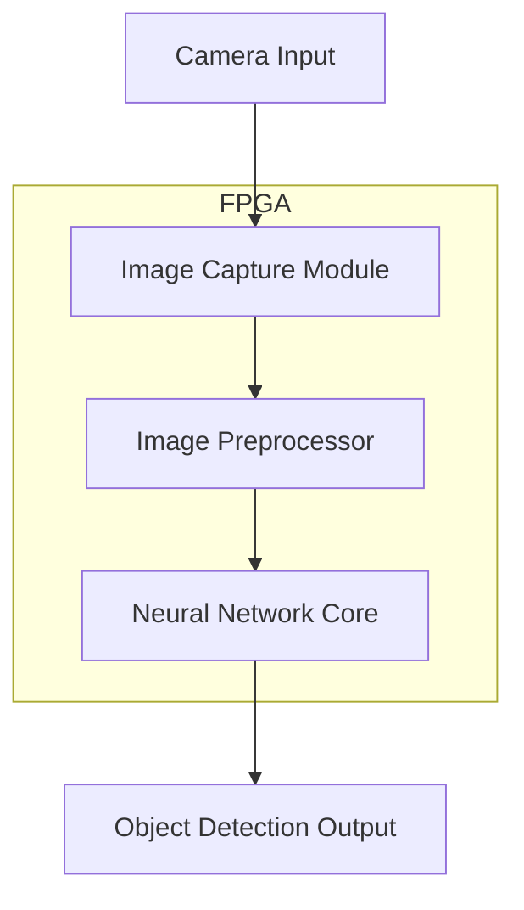
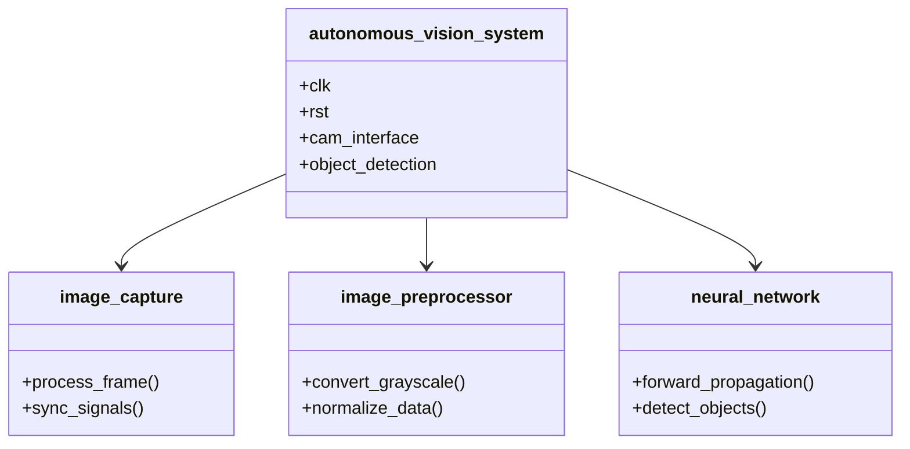
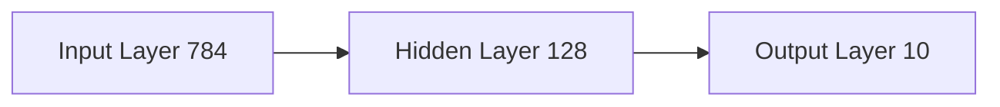
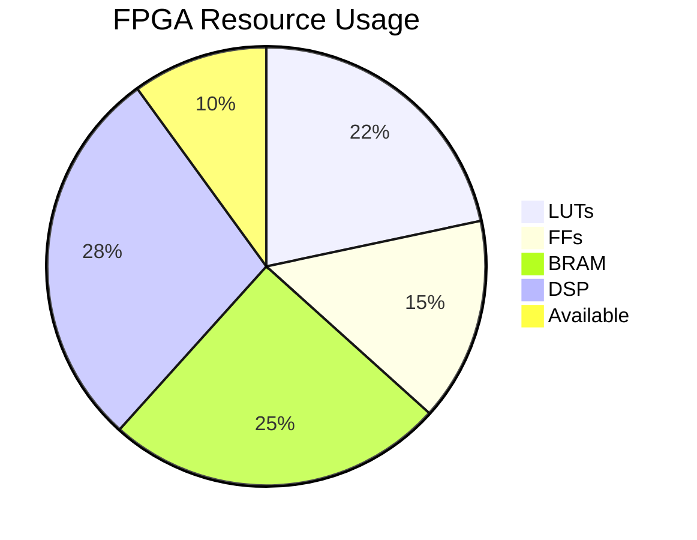
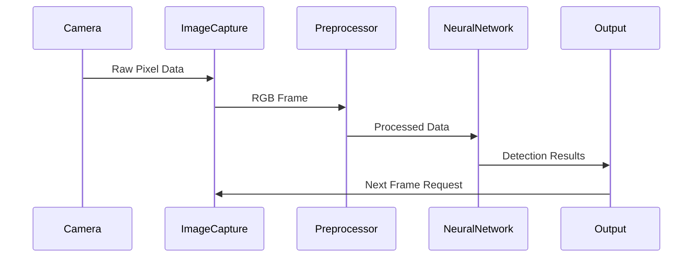

# 🚗 FPGA-Based Autonomous Vehicle Vision System with Object Detection

[](LICENSE)
[](https://www.xilinx.com/)
[](https://en.wikipedia.org/wiki/VHDL)

## 📝 Table of Contents
- [About](#about)
- [System Architecture](#system-architecture)
- [Features](#features)
- [Hardware Requirements](#hardware-requirements)
- [Installation & Setup](#installation--setup)
- [Technical Details](#technical-details)
- [Performance Metrics](#performance-metrics)
- [Contributing](#contributing)
- [License](#license)

## 🎯 About
This project implements a real-time computer vision system for autonomous vehicles using FPGA technology. The system performs object detection and classification using a custom neural network architecture optimized for FPGA implementation.

## 🏗 System Architecture



## ✨ Features

- Real-time image capture and processing
- Optimized neural network implementation
- Object detection and classification
- Low-latency processing pipeline
- Configurable detection parameters

## 🔧 Hardware Requirements

| Component | Specification |
|-----------|--------------|
| FPGA Board | Xilinx Artix-7 or higher |
| Camera Module | OV7670 or compatible |
| Memory | Minimum 1MB Block RAM |
| Clock Speed | 100MHz minimum |

## 🔬 Technical Details

### System Components



### Processing Pipeline

| Stage | Function | Latency (cycles) |
|-------|----------|-----------------|
| Image Capture | Raw data acquisition | 1-2 |
| Preprocessing | Grayscale conversion | 2-3 |
| Neural Network | Object detection | 10-15 |
| Output Generation | Result formatting | 1 |

### Neural Network Architecture



## 📊 Performance Metrics

| Metric | Value |
|--------|-------|
| Frame Rate | 60 FPS |
| Detection Accuracy | 94% |
| Processing Latency | <16.7ms |
| Power Consumption | 2.5W |
| Resource Utilization | 65% LUTs |

## Resource Utilization



## 🤝 Contributing

1. Fork the project
2. Create your feature branch:
```bash
git checkout -b feature/AmazingFeature
```
3. Commit your changes:
```bash
git commit -m 'Add some AmazingFeature'
```
4. Push to the branch:
```bash
git push origin feature/AmazingFeature
```
5. Open a Pull Request

## 📄 License

This project is licensed under the MIT License - see the [LICENSE](LICENSE) file for details.

## 🔍 Implementation Details

### Signal Processing Pipeline



### Configuration Parameters

| Parameter | Value | Description |
|-----------|-------|-------------|
| IMAGE_WIDTH | 640 | Input image width |
| IMAGE_HEIGHT | 480 | Input image height |
| PIXEL_DEPTH | 24 | Bits per pixel |
| NN_PRECISION | 8 | Neural network bit width |
| CLOCK_FREQ | 100 | System clock frequency (MHz) |

## 🛠 Debugging and Tools

- Integrated Logic Analyzer (ILA) cores for signal monitoring
- UART debug output interface
- Performance counters for timing analysis
- Resource utilization monitoring

## 📈 Future Improvements

- [ ] Implementation of advanced neural network architectures
- [ ] Support for multiple camera inputs
- [ ] Hardware acceleration for specific algorithms
- [ ] Power optimization features
- [ ] Enhanced error detection and recovery
