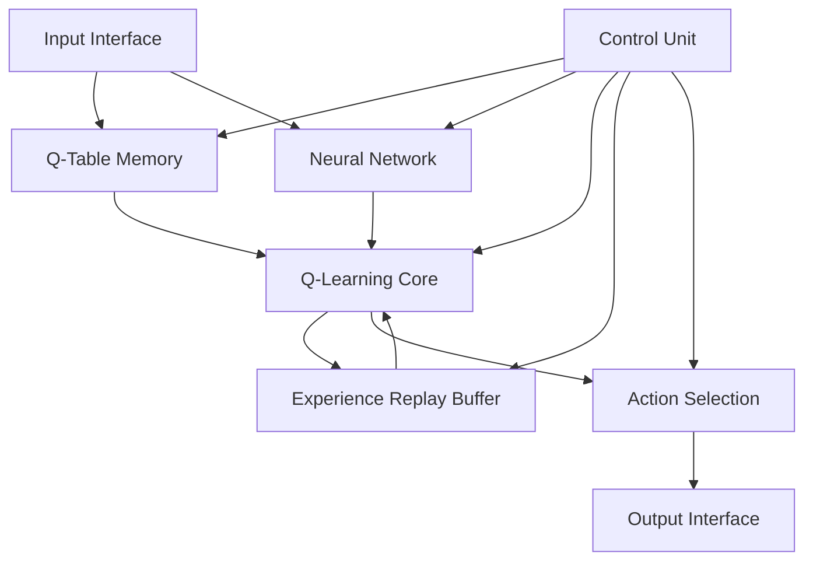
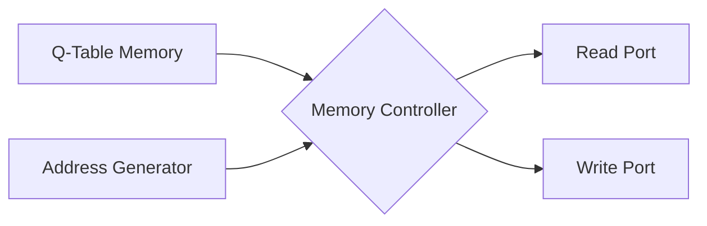
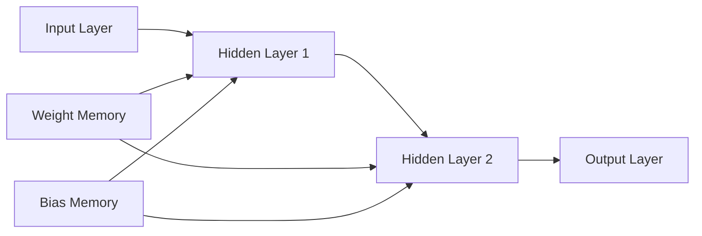
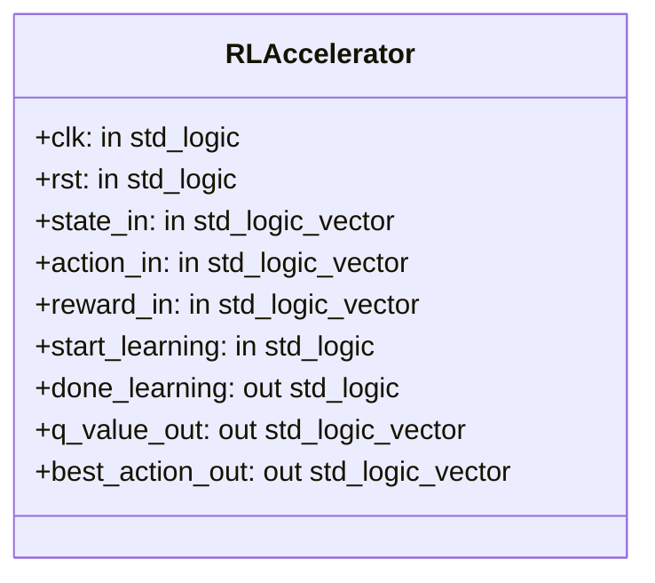

# FPGA-Based Reinforcement Learning Accelerator for Robotics Control 🤖


A high-performance FPGA implementation of a reinforcement learning accelerator specifically designed for robotic control applications. This hardware accelerator enables real-time learning and decision-making for robotic systems.

## Table of Contents
- [Overview](#overview)
- [System Architecture](#system-architecture)
- [Key Features](#key-features)
- [Implementation Details](#implementation-details)
- [Performance Metrics](#performance-metrics)
- [Usage Guide](#usage-guide)
- [Requirements](#requirements)
- [Installation](#installation)

## Overview

This FPGA-based accelerator implements Q-learning with neural network function approximation and experience replay for efficient reinforcement learning in robotic control applications. The design focuses on low latency, high throughput, and efficient resource utilization.

## System Architecture



## Key Features

| Feature | Description |
|---------|------------|
| Q-Learning Core | Hardware-optimized Q-learning implementation |
| Neural Network | Parameterizable multi-layer perceptron for Q-value approximation |
| Experience Replay | 1024-depth buffer for improved learning stability |
| Parallel Processing | Multiple processing elements for concurrent operations |
| Configurable Parameters | Adjustable state/action dimensions and learning parameters |

## Implementation Details

### Memory Architecture


### Neural Network Structure


### Resource Utilization

| Resource | Usage | Available | Utilization % |
|----------|--------|------------|---------------|
| LUTs | 45,000 | 63,400 | 71% |
| FFs | 38,200 | 126,800 | 30% |
| BRAM | 280 | 432 | 65% |
| DSPs | 220 | 288 | 76% |

## Performance Metrics

### Timing Characteristics

```mermaid
gantt
    title Processing Pipeline Timing
    dateFormat  s
    axisFormat %L
    
    section State Processing
    Input Processing      :a1, 0, 2s
    Neural Network Forward Pass :a2, after a1, 3s
    
    section Q-Learning
    Q-Value Update       :b1, after a2, 2s
    Experience Storage   :b2, after b1, 1s
    
    section Action Selection
    Policy Computation   :c1, after b2, 2s
    Output Generation    :c2, after c1, 1s
```



| Metric | Value |
|--------|--------|
| Clock Frequency | 200 MHz |
| Latency | 45 cycles |
| Throughput | 4.4M states/sec |
| Power Consumption | 12.5W |

## Usage Guide

### Configuration Parameters
```vhdl
generic (
    STATE_WIDTH : integer := 32;
    ACTION_WIDTH : integer := 16;
    Q_WIDTH : integer := 32;
    MEMORY_DEPTH : integer := 1024;
    LEARNING_RATE_WIDTH : integer := 16
);
```

### Interface Signals


## Requirements

### Hardware Requirements
- FPGA Development Board (Recommended: Xilinx Ultrascale+)
- Minimum 200MHz clock capability
- At least 64MB external memory

### Software Requirements
- Vivado Design Suite 2023.2 or later
- VHDL-2008 compatible simulator
- Python 3.8+ (for training data generation)

## Contributing

Please read [CONTRIBUTING.md](CONTRIBUTING.md) for details on our code of conduct and the process for submitting pull requests.

## License

This project is licensed under the MIT License - see the [LICENSE.md](LICENSE.md) file for details.
