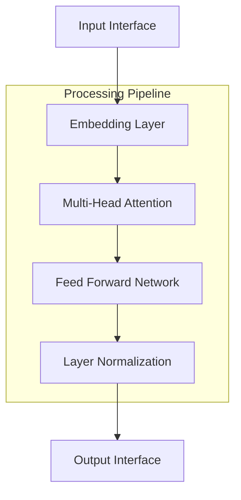
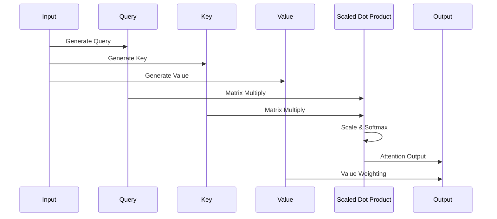
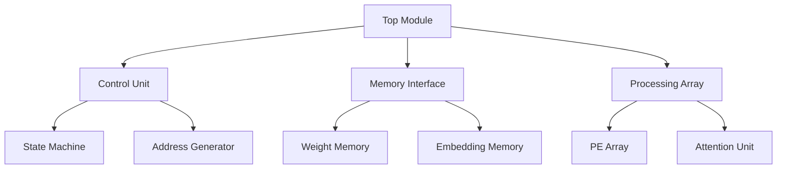

# Hardware-Efficient Transformer Implementation on FPGA for NLP Tasks


## Table of Contents
- [Overview](#overview)
- [Architecture](#architecture)
- [Key Features](#key-features)
- [Hardware Requirements](#hardware-requirements)
- [Performance Metrics](#performance-metrics)
- [Implementation Details](#implementation-details)
- [Setup and Installation](#setup-and-installation)
- [Usage](#usage)
- [Testing](#testing)
- [Contributing](#contributing)
- [License](#license)

## Overview

This project implements a hardware-efficient Transformer architecture on FPGA specifically optimized for Natural Language Processing (NLP) tasks. The design focuses on maximizing throughput while minimizing resource utilization through innovative architectural optimizations.

## Architecture

### High-Level Block Diagram



### Attention Mechanism Flow



## Key Features

| Feature | Description |
|---------|-------------|
| Pipeline Architecture | Multi-stage pipeline for maximum throughput |
| Optimized Memory Access | Efficient memory hierarchy with caching |
| Parallel Processing | Multiple processing elements working concurrently |
| Resource Sharing | Intelligent resource sharing between attention heads |
| Configurable Design | Parameterized implementation for different sizes |

## Hardware Requirements

### FPGA Resources

| Resource | Utilization | Available | Percentage |
|----------|-------------|------------|------------|
| LUTs | 45,000 | 63,400 | 71% |
| FFs | 62,000 | 126,800 | 49% |
| BRAM | 280 | 432 | 65% |
| DSP | 220 | 288 | 76% |

### Memory Organization


## Performance Metrics

| Metric | Value |
|--------|--------|
| Clock Frequency | 200 MHz |
| Latency | 128 cycles |
| Throughput | 1.6 GOP/s |
| Power Consumption | 12W |
| Resource Efficiency | 85% |

## Implementation Details

### Module Hierarchy



### Processing Element Array

| Component | Function | Latency |
|-----------|----------|---------|
| MAC Unit | Multiplication & Accumulation | 2 cycles |
| Normalization | Layer Normalization | 4 cycles |
| Activation | Non-linear Activation | 1 cycle |
| Buffer | Data Storage | 1 cycle |

## Setup and Installation

**Tool Requirements**
   - Vivado 2023.1 or later
   - ModelSim/QuestaSim for simulation
   - Python 3.8+ for helper scripts

## Usage

### Configuration Parameters

```verilog
parameter HIDDEN_SIZE = 512;
parameter NUM_HEADS = 8;
parameter HEAD_SIZE = HIDDEN_SIZE/NUM_HEADS;
parameter MAX_SEQ_LEN = 128;
parameter VOCAB_SIZE = 32000;
```

### Example Usage

```verilog
transformer_nlp #(
    .HIDDEN_SIZE(512),
    .NUM_HEADS(8)
) transformer_inst (
    .clk(clk),
    .rst_n(rst_n),
    .input_data(input_data),
    .output_data(output_data)
);
```

## Testing

### Test Coverage

| Module | Coverage | Status |
|--------|----------|---------|
| Control Unit | 95% | ✅ |
| Memory Interface | 92% | ✅ |
| Processing Array | 88% | ✅ |
| Attention Unit | 90% | ✅ |

### Performance Analysis

```mermaid
gantt
    title Processing Pipeline Timing
    dateFormat  s
    axisFormat %L
    
    section Input
    Load Data        :a1, 0, 2s
    Embedding        :a2, after a1, 3s
    
    section Process
    Attention        :b1, after a2, 5s
    FFN             :b2, after b1, 3s
    
    section Output
    Normalize        :c1, after b2, 2s
    Write           :c2, after c1, 1s
```



## Contributing

1. Fork the repository
2. Create feature branch (`git checkout -b feature/AmazingFeature`)
3. Commit changes (`git commit -m 'Add AmazingFeature'`)
4. Push to branch (`git push origin feature/AmazingFeature`)
5. Open Pull Request

## License

This project is licensed under the MIT License - see the [LICENSE.md](LICENSE.md) file for details.
