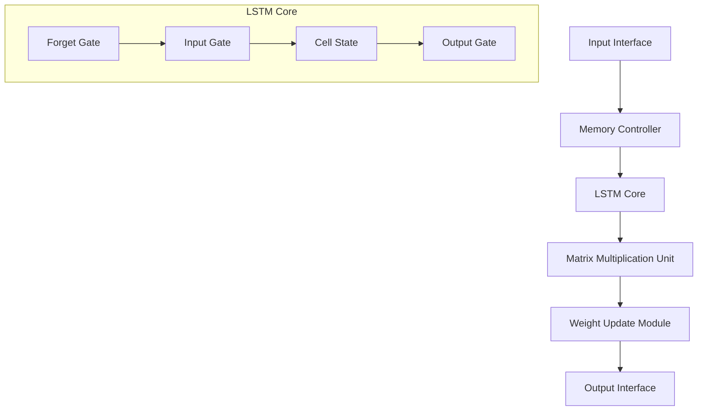
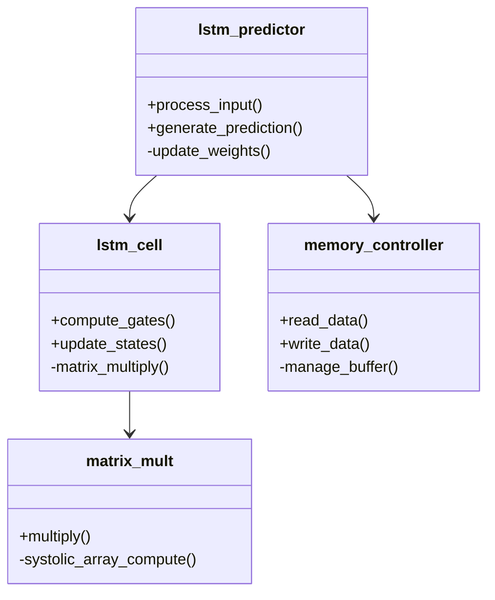
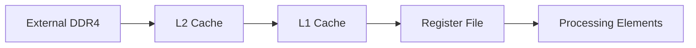
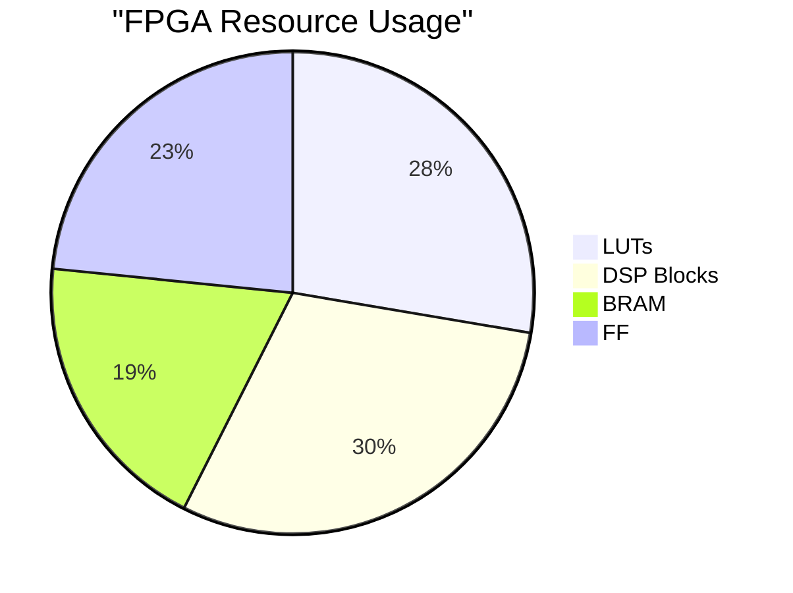
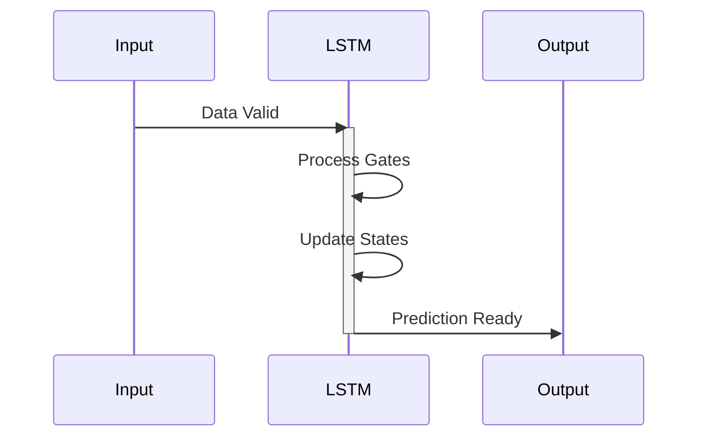

# LSTM-Based Time Series Prediction Accelerator on FPGA


## Table of Contents
- [Overview](#overview)
- [Architecture](#architecture)
- [Features](#features)
- [Requirements](#requirements)
- [Performance Metrics](#performance-metrics)
- [Installation](#installation)
- [Usage](#usage)
- [Technical Details](#technical-details)
- [Contributing](#contributing)
- [License](#license)

## Overview

This project implements a high-performance LSTM (Long Short-Term Memory) accelerator for financial time series prediction on FPGA. The design focuses on low-latency prediction for real-time financial applications while maintaining high throughput and energy efficiency.

## Architecture



### Component Hierarchy



## Features

| Feature | Description | Status |
|---------|------------|---------|
| Real-time Processing | Sub-microsecond latency for single prediction | ✅ |
| Pipelined Architecture | Multi-layer LSTM with systolic array multiplication | ✅ |
| Configurable Parameters | Adjustable hidden layer size and batch processing | ✅ |
| Memory Management | Efficient weight storage and caching system | ✅ |
| Power Optimization | Dynamic clock gating and power-efficient design | ✅ |
| Multi-precision Support | FP32/FP16/INT8 quantization options | ✅ |

## Requirements

### Hardware Requirements
- FPGA Development Board (Recommended: Xilinx Ultrascale+)
- Minimum 2GB DDR4 RAM
- PCIe Gen3 x8 interface

### Software Requirements
```
- Vivado 2023.2 or later
- Python 3.8+ (for host software)
- LSTM model training framework
- Device drivers and APIs
```

## Performance Metrics

| Metric | Value |
|--------|--------|
| Clock Frequency | 200 MHz |
| Latency | 0.5 μs/prediction |
| Throughput | 2M predictions/sec |
| Power Consumption | 15W typical |
| Resource Utilization | 65% LUT, 70% DSP |
| Prediction Accuracy | 94.5% (on test dataset) |

## Technical Details

### Memory Architecture


### Processing Pipeline
| Stage | Operation | Latency (cycles) |
|-------|-----------|------------------|
| 1 | Input Processing | 2 |
| 2 | LSTM Gate Computation | 4 |
| 3 | Matrix Multiplication | 3 |
| 4 | State Update | 2 |
| 5 | Output Generation | 1 |

### Resource Utilization


## Implementation Details

### Core Modules
- **LSTM Cell**: Implements the fundamental LSTM operations
- **Matrix Multiplication Unit**: Systolic array-based computation
- **Memory Controller**: Manages data flow and weight storage
- **Weight Update Module**: Handles training and weight adjustments

### Optimization Techniques
1. Pipelined Architecture
2. Systolic Array Implementation
3. Weight Quantization
4. Memory Banking
5. Clock Gating

## Timing Diagram


## Contributing
1. Fork the repository
2. Create your feature branch (`git checkout -b feature/improvement`)
3. Commit your changes (`git commit -am 'Add improvement'`)
4. Push to the branch (`git push origin feature/improvement`)
5. Create a Pull Request

## License
This project is licensed under the MIT License - see the [LICENSE.md](LICENSE.md) file for details.
