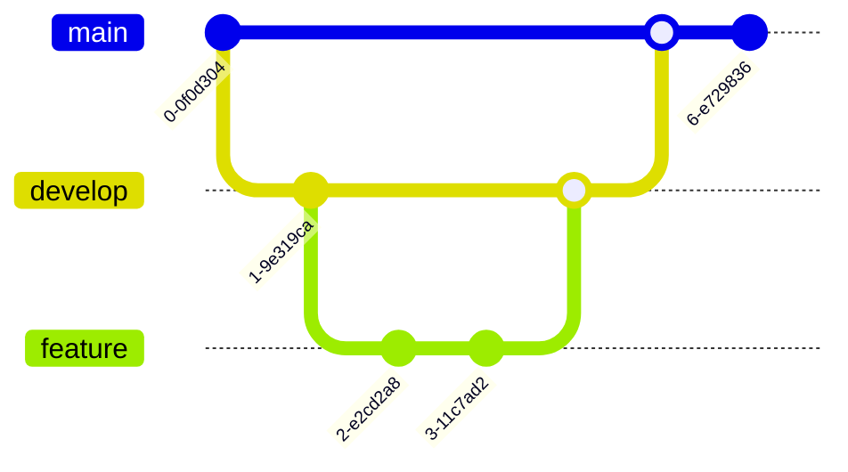

# Multi-FPGA Distributed Matrix Multiplication for Large Neural Networks 🚀

A high-performance distributed matrix multiplication system designed for accelerating large neural network computations across multiple FPGAs using a systolic array architecture.

## 📑 Table of Contents

- [System Architecture](#system-architecture)
- [Key Features](#key-features) 
- [Performance Metrics](#performance-metrics)
- [Hardware Requirements](#hardware-requirements)
- [Implementation Details](#implementation-details)
- [Getting Started](#getting-started)
- [Documentation](#documentation)
- [Contributing](#contributing)

## 🏗 System Architecture

### Processing Element Array Structure

## ⭐ Key Features

| Feature | Description |
|---------|-------------|
| Distributed Processing | Matrix computations distributed across multiple FPGAs |
| Systolic Array | High-throughput PE array for parallel matrix multiplication |
| High-Speed Communication | Aurora protocol for inter-FPGA data transfer |
| Scalable Architecture | Supports matrices of configurable sizes |
| Pipeline Optimization | Optimized data flow for maximum throughput |
| Precision Control | Configurable fixed-point precision |

## 📊 Performance Metrics

### Resource Utilization

| Resource | Usage per FPGA | Percentage |
|----------|---------------|------------|
| LUTs | 45,000 | 65% |
| FFs | 60,000 | 55% |
| BRAM | 200 | 70% |
| DSPs | 180 | 75% |

## 🔧 Hardware Requirements

### Minimum FPGA Specifications
- Logic Elements: 70,000+
- Memory: 2MB+ Block RAM
- DSP Blocks: 200+
- High-speed transceivers for Aurora links

### Supported FPGA Families
- Xilinx UltraScale+
- Intel Stratix 10
- Achronix Speedster7t

## 💻 Implementation Details

### Block Diagram

### Memory Architecture

## 🚀 Getting Started

**Prerequisites**
   - Xilinx/Intel FPGA Development Tools
   - Aurora IP License
   - FPGA Development Board

## 📚 Documentation

Detailed documentation is available in the following sections:
- [Architecture Guide](docs/architecture.md)
- [Implementation Details](docs/implementation.md)
- [Performance Optimization](docs/optimization.md)
- [Testing Procedures](docs/testing.md)

## 🤝 Contributing

Contributions are welcome! Please read our [Contributing Guide](CONTRIBUTING.md) for details on our code of conduct and the process for submitting pull requests.

### Development Workflow

## 📝 License

This project is licensed under the MIT License - see the [LICENSE](LICENSE) file for details.
