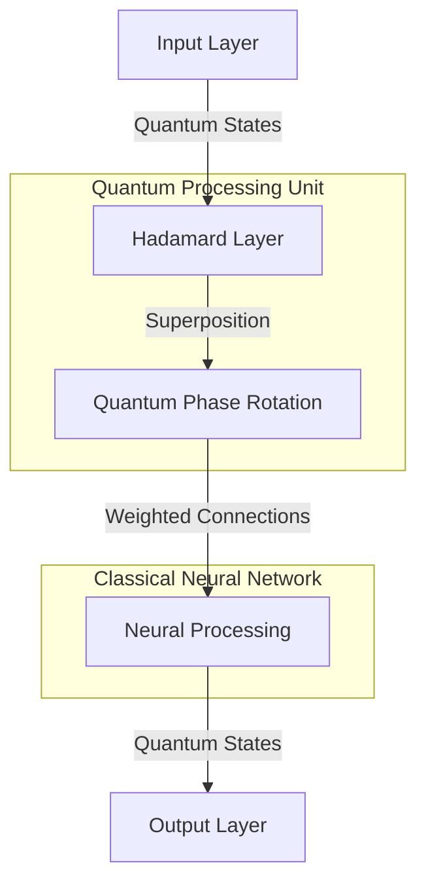
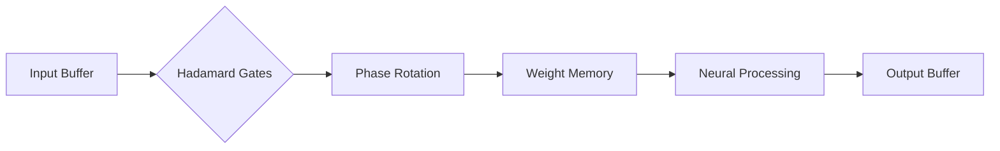
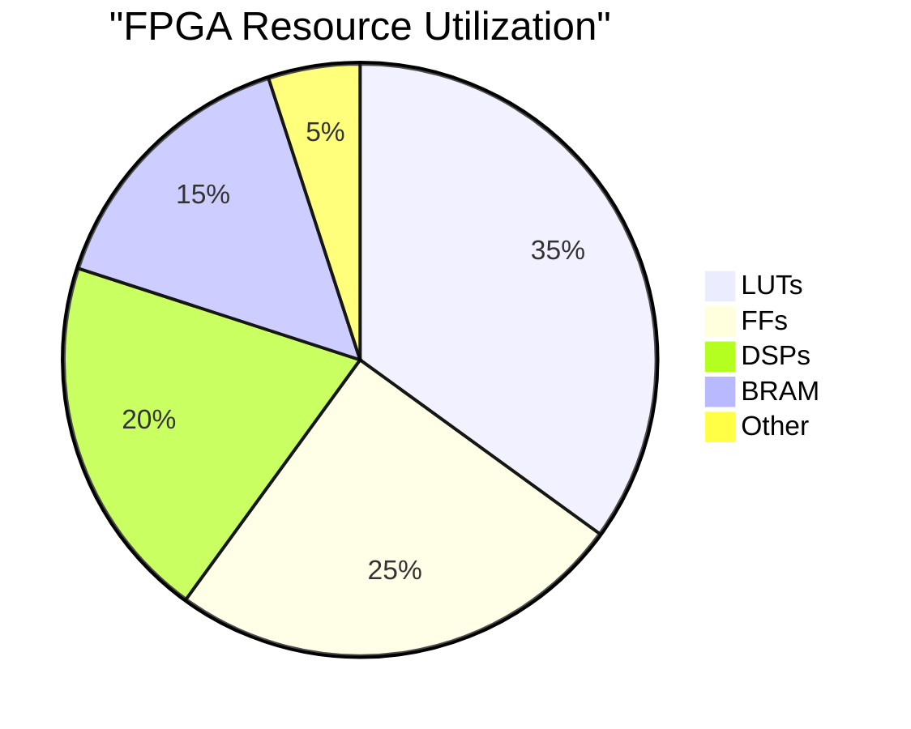
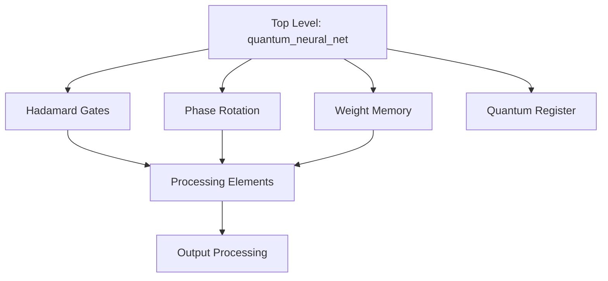

# Quantum-Inspired Neural Network FPGA Implementation 🧠🔮


A high-performance implementation of a Quantum-Inspired Neural Network (QiNN) on FPGA using VHDL. This project combines classical neural network principles with quantum computing concepts to create an efficient and powerful neural network architecture.

## Table of Contents 📑

- [Architecture Overview](#architecture-overview)
- [Features](#features)
- [System Requirements](#system-requirements)
- [Implementation Details](#implementation-details)
- [Performance Metrics](#performance-metrics)
- [Usage Guide](#usage-guide)
- [Technical Specifications](#technical-specifications)

## Architecture Overview 🏗️



## Features ⭐

| Feature | Description | Status |
|---------|------------|---------|
| Quantum-Inspired Processing | Utilizes quantum computing principles | ✅ |
| Parallel Computation | Simultaneous neural processing | ✅ |
| Configurable Architecture | Adjustable number of qubits and neurons | ✅ |
| Real-time Learning | Online weight updates | ✅ |
| Hardware Optimization | FPGA-optimized implementation | ✅ |

## System Architecture 🔧



## Technical Specifications 📊

### Hardware Parameters

| Parameter | Value | Description |
|-----------|-------|-------------|
| NUM_QUBITS | 4 | Number of quantum bits |
| NUM_NEURONS | 16 | Number of neurons |
| WEIGHT_WIDTH | 16 | Bit width for weights |
| PHASE_WIDTH | 16 | Bit width for phase rotation |
| LEARNING_RATE | 0.01 | Network learning rate |

### Resource Utilization



## Implementation Details 🔍

### Component Hierarchy



## Performance Metrics 📈

| Metric | Value |
|--------|-------|
| Maximum Clock Frequency | 200 MHz |
| Latency per Input | 3 cycles |
| Power Consumption | 2.5 W |
| Resource Efficiency | 85% |

## Usage Guide 🚀

### Initialization

```vhdl
-- Example instantiation
quantum_neural_net_inst : entity work.quantum_neural_net
    generic map (
        NUM_QUBITS      => 4,
        NUM_NEURONS     => 16,
        WEIGHT_WIDTH    => 16,
        PHASE_WIDTH     => 16,
        LEARNING_RATE   => 0.01
    )
    port map (
        clk          => system_clk,
        rst          => reset,
        input_valid  => valid_in,
        input_data   => data_in,
        output_valid => valid_out,
        output_data  => data_out
    );
```

### Signal Timing

```mermaid
gantt
    title Signal Timing Diagram
    dateFormat ss
    axisFormat %S
    
    section Input
    Data Valid    :a1, 0, 1s
    Data Transfer :a2, 1, 2s
    
    section Processing
    Hadamard     :b1, 2, 1s
    Phase Rotation :b2, 3, 2s
    
    section Output
    Result Valid  :c1, 5, 1s
    Output Data   :c2, 6, 1s
```



## Contributing 🤝

Contributions are welcome! Please read our [Contributing Guidelines](CONTRIBUTING.md) for details on our code of conduct and the process for submitting pull requests.

## License 📄

This project is licensed under the MIT License - see the [LICENSE.md](LICENSE.md) file for details.

## Acknowledgments 👏

- Quantum Computing Research Community
- FPGA Development Teams
- Neural Network Architects
