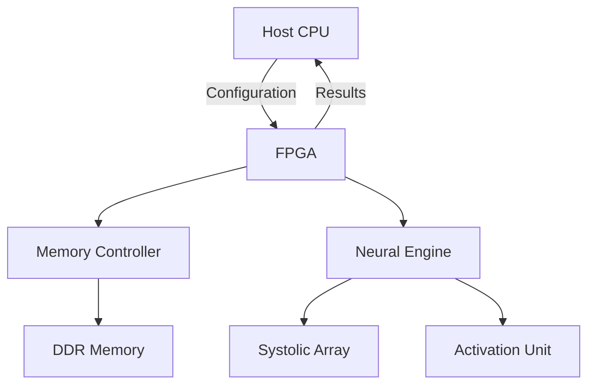

# 🎯 FPGA Programming & Deep Learning Implementation

<div align="center">
  
  
  
  
  
</div>

<p align="center">
  <h2 align="center">Hardware-Accelerated Deep Learning on FPGA</h2>
</p>

<div align="center">
  
  [](LICENSE)
  [](https://github.com/Awrsha/FPGA-Programming)
  [](https://github.com/Awrsha/FPGA-Programming/issues)
  
</div>

## 📚 Table of Contents
- [Overview](#-overview)
- [Projects](#-projects)
- [Architecture](#-architecture)
- [Performance](#-performance)
- [Getting Started](#-getting-started)
- [Contributing](#-contributing)
- [License](#-license)

## 🌟 Overview

Advanced FPGA implementations of cutting-edge deep learning models, optimized for high performance and energy efficiency.

## 🏗️ Architecture

### System Overview


### Memory Hierarchy
```
L1 Cache (On-Chip)  : 64KB
L2 Cache (On-Chip)  : 256KB
External DDR        : 4GB
```

## 🛠️ Getting Started

### Prerequisites
```bash
# Required Software
- Xilinx Vivado 2023.1
- Python 3.8+
- TensorFlow 2.x
```

## 🤝 Contributing

We welcome contributions! See our [Contributing Guidelines](CONTRIBUTING.md).

### Development Workflow
1. Fork repository
2. Create feature branch
3. Implement changes
4. Submit pull request
5. Code review
6. Merge

## 📄 License

Apache License 2.0 - [LICENSE](LICENSE)
