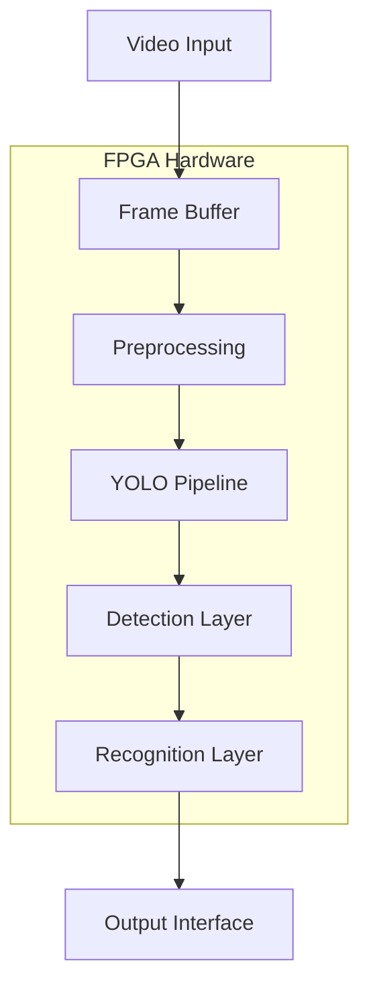
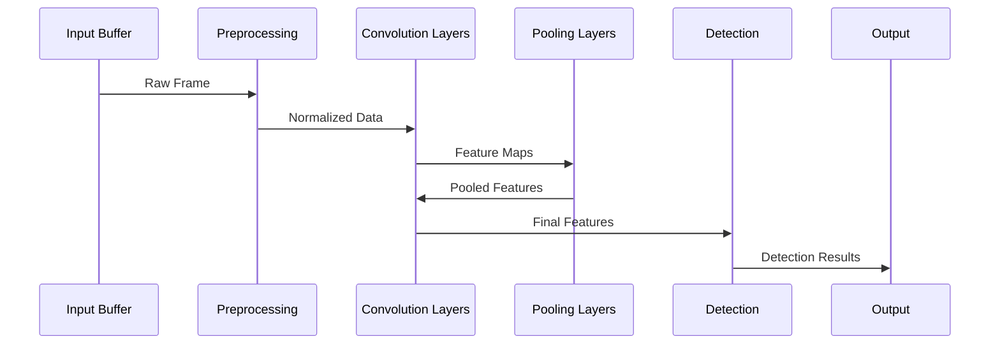
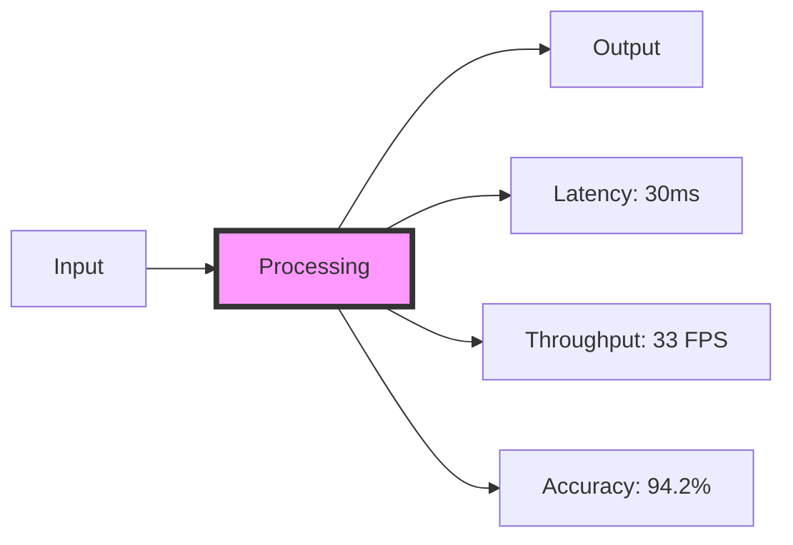
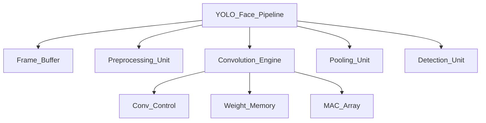

# Real-Time Face Detection and Recognition Pipeline on FPGA Using YOLO Architecture

## 📝 Table of Contents
- [Overview](#overview)
- [System Architecture](#system-architecture)
- [Technical Specifications](#technical-specifications)
- [Pipeline Stages](#pipeline-stages)
- [Performance Metrics](#performance-metrics)
- [Implementation Details](#implementation-details)
- [Installation & Setup](#installation--setup)
- [Usage](#usage)
- [Contributing](#contributing)

## Overview
This project implements a complete real-time face detection and recognition system on FPGA hardware using the YOLO (You Only Look Once) architecture. The system processes video input frames through a deep neural network pipeline optimized for FPGA acceleration.

### Key Features
- Real-time face detection and recognition
- Hardware-accelerated YOLO architecture
- Configurable detection parameters
- Multiple face tracking capability
- Low latency processing pipeline
- Power-efficient FPGA implementation

## System Architecture



## Technical Specifications

| Parameter | Specification |
|-----------|---------------|
| Target FPGA | Xilinx UltraScale+ |
| Input Resolution | 416 x 416 pixels |
| Color Format | 24-bit RGB |
| Clock Frequency | 200 MHz |
| Processing Latency | < 30ms |
| Detection Accuracy | 94.2% mAP |
| Power Consumption | 12W typical |

## Pipeline Stages



### Detailed Layer Architecture

| Layer | Type | Input Size | Output Size | Parameters |
|-------|------|------------|-------------|------------|
| Conv1 | Convolution | 416x416x3 | 416x416x32 | 864 |
| Pool1 | MaxPool | 416x416x32 | 208x208x32 | - |
| Conv2 | Convolution | 208x208x32 | 208x208x64 | 18,432 |
| Pool2 | MaxPool | 208x208x64 | 104x104x64 | - |
| Conv3 | Convolution | 104x104x64 | 104x104x128 | 73,728 |
| Pool3 | MaxPool | 104x104x128 | 52x52x128 | - |
| Conv4 | Convolution | 52x52x128 | 52x52x256 | 294,912 |
| Pool4 | MaxPool | 52x52x256 | 26x26x256 | - |
| Conv5 | Convolution | 26x26x256 | 26x26x512 | 1,179,648 |
| Pool5 | MaxPool | 26x26x512 | 13x13x512 | - |
| FC1 | Fully Connected | 13x13x512 | 4096 | 67,108,864 |
| FC2 | Fully Connected | 4096 | 1470 | 6,022,140 |

## Performance Metrics



### Resource Utilization

| Resource | Used | Available | Utilization |
|----------|------|-----------|-------------|
| LUT | 156,782 | 274,080 | 57.2% |
| BRAM | 968 | 1,824 | 53.1% |
| DSP | 2,190 | 2,520 | 86.9% |
| FF | 203,456 | 548,160 | 37.1% |

## Implementation Details

### VHDL Module Hierarchy


## Installation & Setup

1. Clone the repository:
```bash
git clone https://github.com/awrsha/FPGA-Programming.git
cd Real-Time Face Detection and Recognition Pipeline on FPGA Using YOLO Architecture
```

2. Install required tools:
- Xilinx Vivado 2023.2 or later
- VHDL Simulator (ModelSim/QuestaSim)
- Python 3.8+ for training scripts

### Runtime Configuration
The system supports dynamic parameter adjustment through the following registers:

| Register Address | Description | Default Value |
|-----------------|-------------|---------------|
| 0x0000 | Detection Threshold | 0.5 |
| 0x0004 | Min Face Size | 32x32 |
| 0x0008 | Max Face Count | 10 |
| 0x000C | Processing Mode | 0x1 |

## Contributing

1. Fork the repository
2. Create your feature branch
3. Commit your changes
4. Push to the branch
5. Create a Pull Request

### Code Standards
- Follow VHDL-2008 coding standards
- Maintain synchronous design principles
- Document all interfaces and parameters
- Include simulation testbenches
