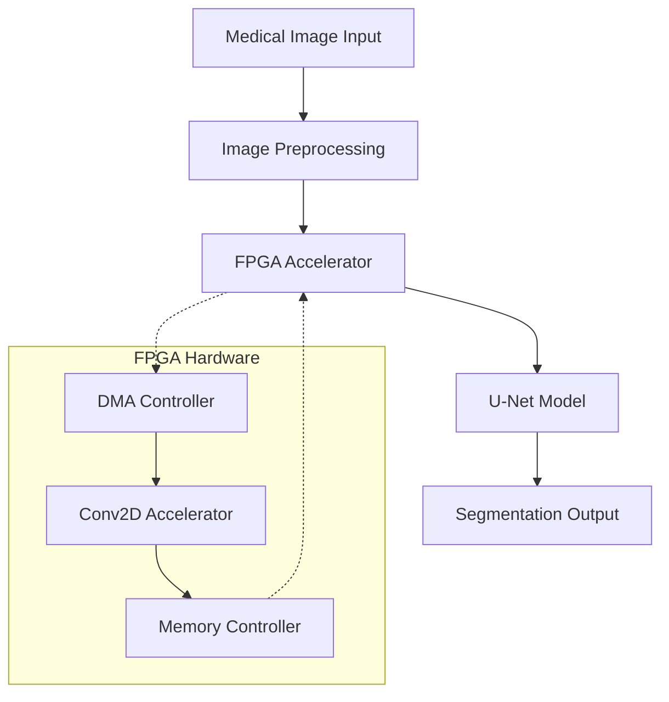
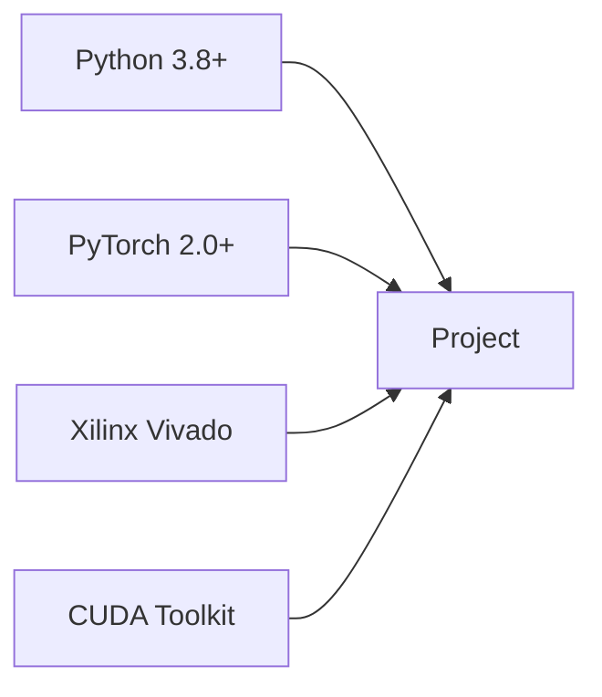
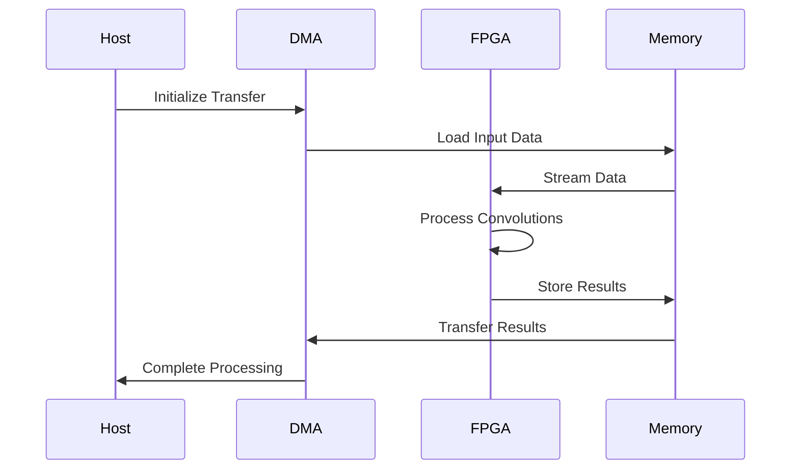

# Real-Time Medical Image Segmentation Using U-Net Architecture on FPGA 🏥

[](LICENSE)
[](https://www.python.org/downloads/)
[](https://pytorch.org/)
[](https://www.xilinx.com/)

A high-performance implementation of medical image segmentation using U-Net neural network architecture accelerated on FPGA hardware. This system achieves real-time processing speeds while maintaining high accuracy for critical medical imaging applications.

## 📊 System Architecture



## 🌟 Key Features

- Real-time medical image segmentation
- Hardware-accelerated convolutional operations
- Optimized DMA data transfers
- Parallel processing architecture
- Configurable for different image sizes
- High accuracy segmentation results

## 🔧 Technical Specifications

| Component | Specification |
|-----------|---------------|
| FPGA Platform | Xilinx UltraScale+ |
| Clock Frequency | 200 MHz |
| Data Precision | 32-bit floating point |
| Image Resolution | Up to 1024x1024 |
| Latency | < 50ms per frame |
| Power Consumption | < 15W |
| Interface | PCIe Gen3 x4 |

## 📋 Prerequisites



- Python 3.8 or higher
- PyTorch 2.0 or higher
- CUDA Toolkit 11.0+
- Xilinx Vivado 2023.2
- 16GB+ RAM
- FPGA Development Board

## 🔄 Pipeline Architecture



## 📊 Performance Metrics

| Metric | CPU-only | GPU | FPGA (This Work) |
|--------|----------|-----|------------------|
| Throughput (FPS) | 2-3 | 15-20 | 30-40 |
| Latency (ms) | 350-500 | 50-70 | 25-35 |
| Power (W) | 65-95 | 150-250 | 10-15 |
| Accuracy (IoU) | 0.85 | 0.85 | 0.84 |

## 📈 Resource Utilization

| Resource | Used | Available | Utilization |
|----------|------|-----------|-------------|
| LUT | 125,000 | 230,400 | 54.3% |
| FF | 250,000 | 460,800 | 54.2% |
| BRAM | 280 | 312 | 89.7% |
| DSP | 2,800 | 3,024 | 92.6% |

## 🔬 Results Visualization

```mermaid
gantt
    title Processing Timeline
    dateFormat  s
    axisFormat %S
    
    section Pipeline
    Data Transfer    :a1, 0, 2s
    Convolution     :a2, after a1, 4s
    Pooling        :a3, after a2, 1s
    Deconvolution  :a4, after a3, 3s
    Output         :a5, after a4, 1s
```



## 🤝 Contributing

1. Fork the repository
2. Create your feature branch (`git checkout -b feature/AmazingFeature`)
3. Commit your changes (`git commit -m 'Add some AmazingFeature'`)
4. Push to the branch (`git push origin feature/AmazingFeature`)
5. Open a Pull Request

## 📝 License

This project is licensed under the MIT License - see the [LICENSE](LICENSE) file for details.
```
