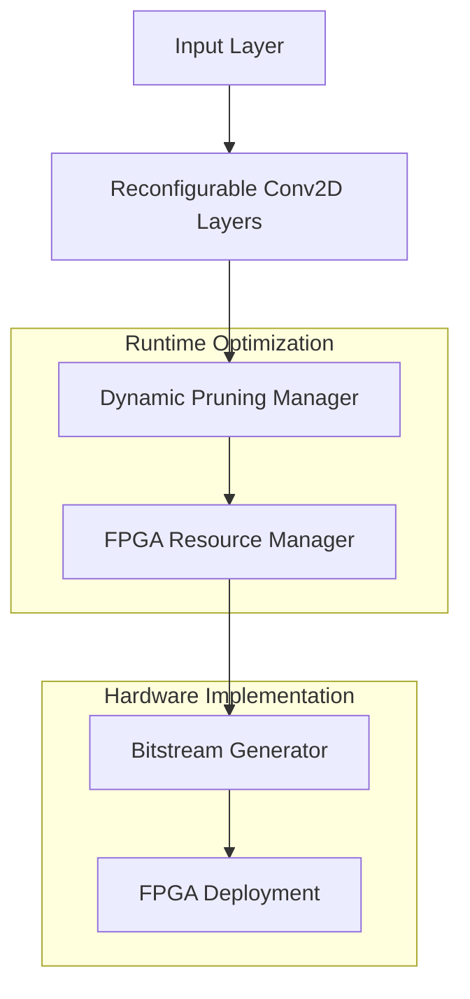
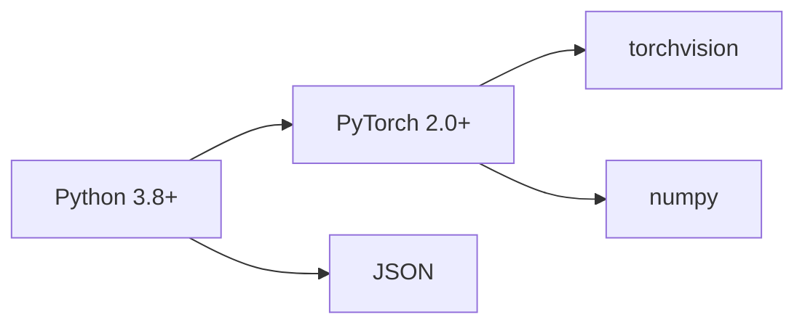
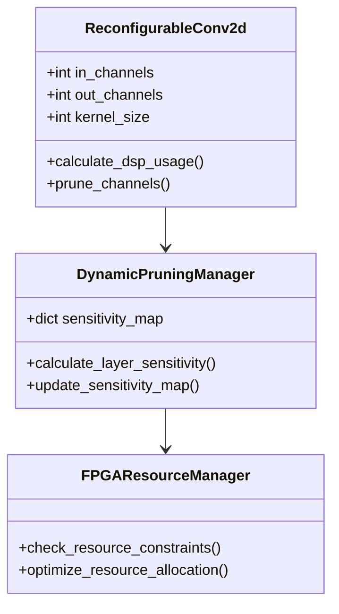
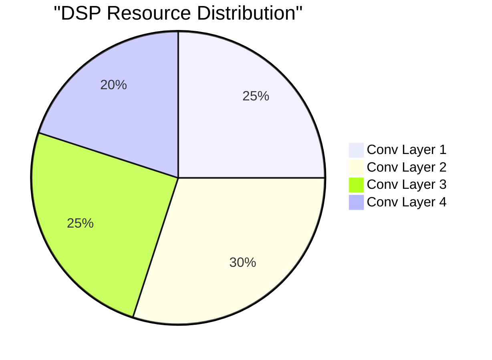
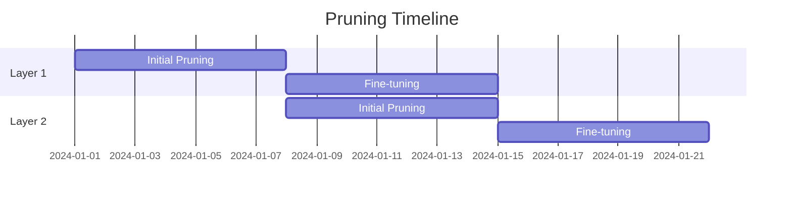
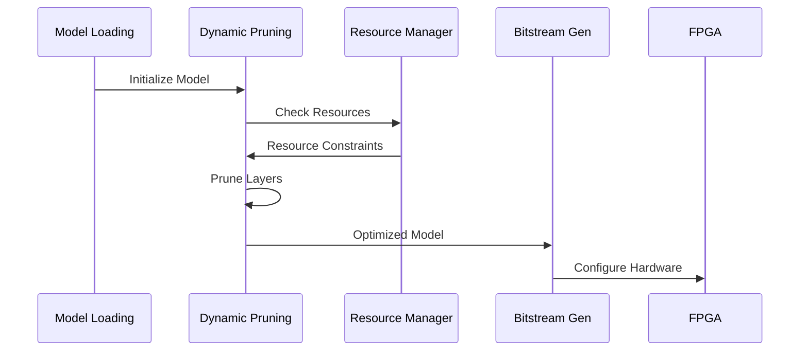

# Reconfigurable CNN Architecture with Dynamic Pruning on FPGA 🧠

A high-performance, resource-efficient implementation of a Convolutional Neural Network (CNN) architecture with dynamic pruning capabilities deployed on FPGA hardware. This project optimizes neural network performance through runtime reconfiguration and intelligent resource management.

## Table of Contents
- [Architecture Overview](#architecture-overview)
- [Key Features](#key-features)
- [System Requirements](#system-requirements)
- [Installation](#installation)
- [Usage](#usage)
- [Component Breakdown](#component-breakdown)
- [Resource Management](#resource-management)
- [Performance Metrics](#performance-metrics)
- [Contributing](#contributing)
- [License](#license)

## Architecture Overview

## Key Features

| Feature | Description | Priority |
|---------|-------------|----------|
| Dynamic Pruning | Runtime channel pruning based on sensitivity analysis | High |
| Resource Optimization | Intelligent DSP and BRAM allocation | High |
| Reconfigurable Layers | Adaptable network architecture | Medium |
| Bitstream Generation | Automated FPGA configuration generation | Medium |
| Performance Monitoring | Real-time resource utilization tracking | Low |

## System Requirements

### Software Dependencies

### Hardware Requirements
- FPGA: Xilinx Virtex UltraScale+
- DSP Slices: 5760
- BRAM: 2160 (36Kb blocks)
- Clock Frequency: 200 MHz
- Power Budget: 20W

## Component Breakdown

### Layer Architecture

## Resource Management

### DSP Allocation Strategy

### Memory Hierarchy
| Level | Type | Size | Latency |
|-------|------|------|----------|
| L1 Cache | BRAM | 256KB | 1 cycle |
| L2 Cache | BRAM | 1MB | 2-3 cycles |
| External | DDR4 | 16GB | 100+ cycles |

## Performance Metrics

### Pruning Efficiency

### Resource Utilization
| Resource | Available | Used | Utilization |
|----------|-----------|------|-------------|
| DSP | 5760 | 4320 | 75% |
| BRAM | 2160 | 1512 | 70% |
| LUT | 1.3M | 850K | 65% |
| FF | 2.6M | 1.5M | 58% |

## Implementation Flow

## Contributing

1. Fork the repository
2. Create your feature branch (`git checkout -b feature/amazing-feature`)
3. Commit your changes (`git commit -m 'Add amazing feature'`)
4. Push to the branch (`git push origin feature/amazing-feature`)
5. Open a Pull Request

## License

This project is licensed under the MIT License - see the [LICENSE.md](LICENSE.md) file for details.
